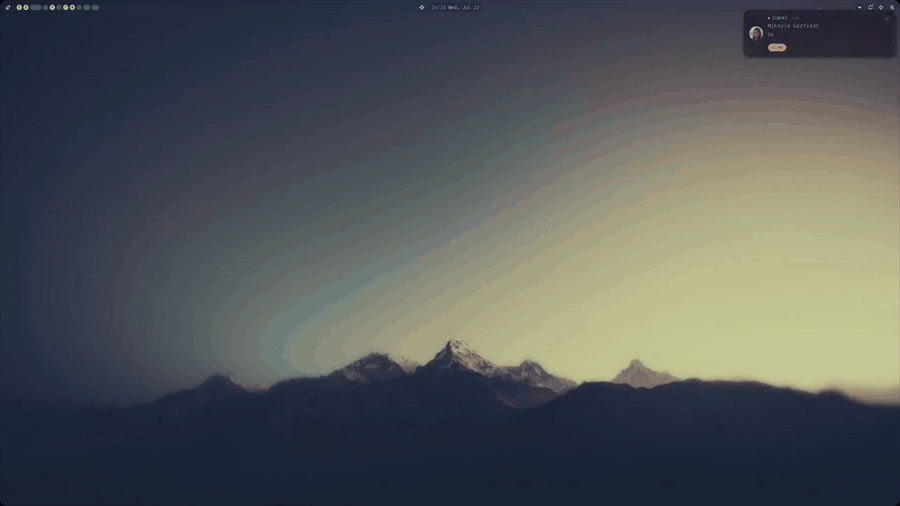

# 🦊 Focus Fox

A terminal-based pomodoro timer. Work sessions, short breaks, and a long
break every few sessions — with a big clock, a progress ring with a fox
in the middle, and desktop notifications when phases change.

## Demo



*4x speed — [full demo video](assets/focus-fox-demo.mp4).*

## Usage

```bash
fox                             # 25m work / 5m break / 15m long break every 4
fox -w 45m -b 10m               # custom work and break lengths
fox --sessions 3                # long break after 3 work sessions
fox --no-notify                 # skip desktop notifications
```

The binary is installed as both `fox` and `focus-fox` — same program.

Launch opens a configuration menu; tweak values there (or skip straight
past it with Enter) and start the timer.

### Keys

Menu (launch screen):

| Key           | Action                        |
|---------------|-------------------------------|
| `↑`/`↓`, `k`/`j` | select setting             |
| `←`/`→`, `h`/`l` | adjust value               |
| `Enter`       | start the timer               |
| `q`/`Esc`     | quit                          |

Menu changes are saved automatically and persist between app starts.

Timer:

| Key         | Action              |
|-------------|---------------------|
| `space`/`p` | pause / resume      |
| `s`         | skip to next phase  |
| `r`         | restart this phase  |
| `m`         | back to the menu    |
| `q`/`Esc`   | quit                |

## Configuration

Settings live at `~/.config/focus-fox/config.toml`, written automatically
whenever you adjust them in the menu (CLI flags override at launch):

```toml
work = "25m"
short_break = "5m"
long_break = "15m"
sessions_before_long_break = 4
notify = true
```

## Development

```bash
nix develop     # dev shell with rust toolchain + libnotify
cargo run
cargo test
nix build       # release build with notify-send wrapped onto PATH
```
