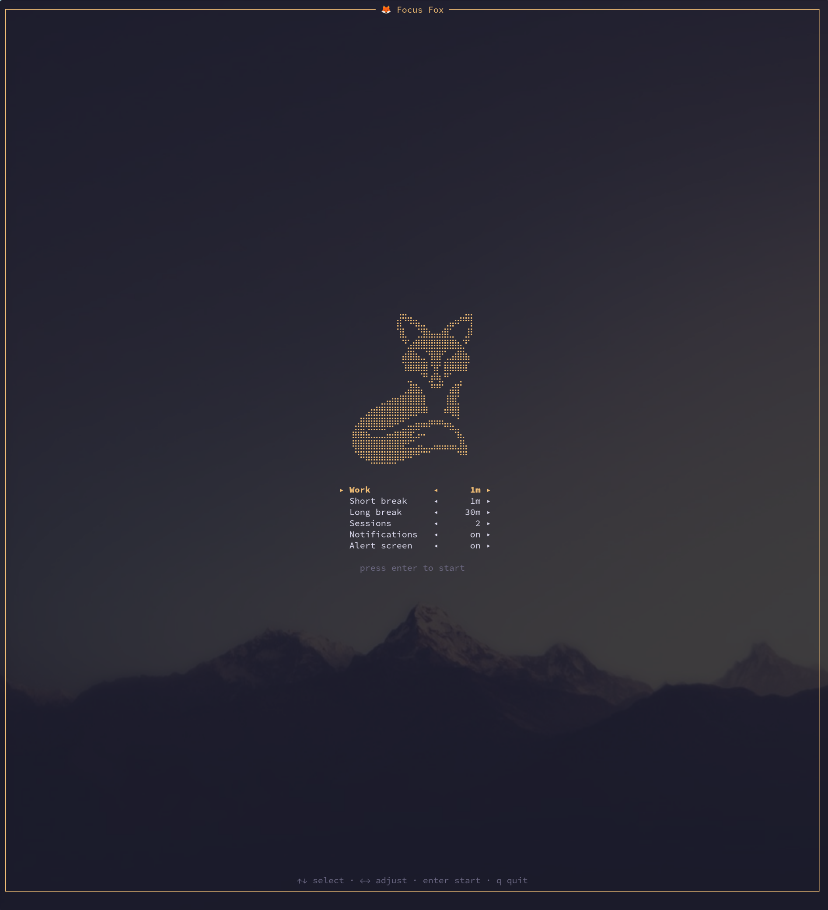
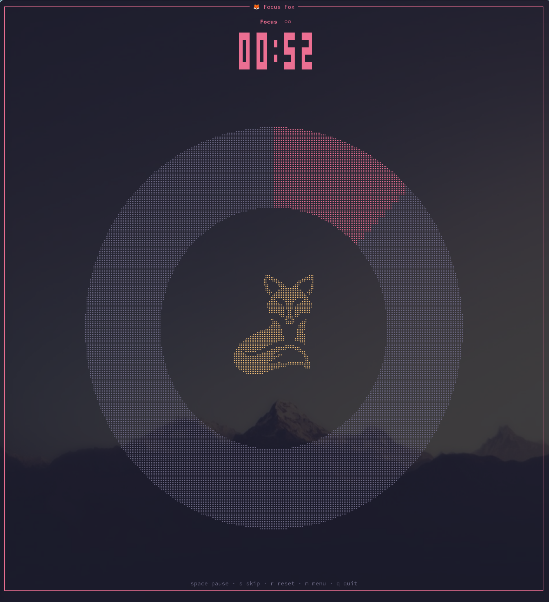
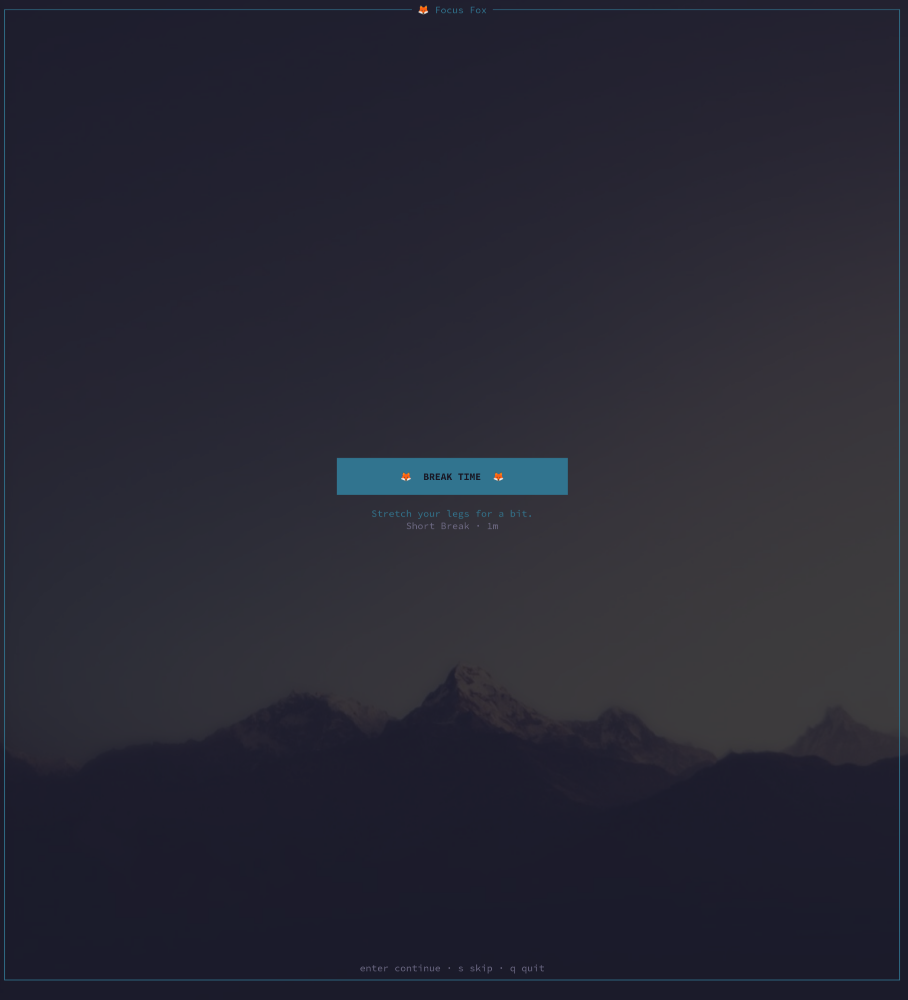
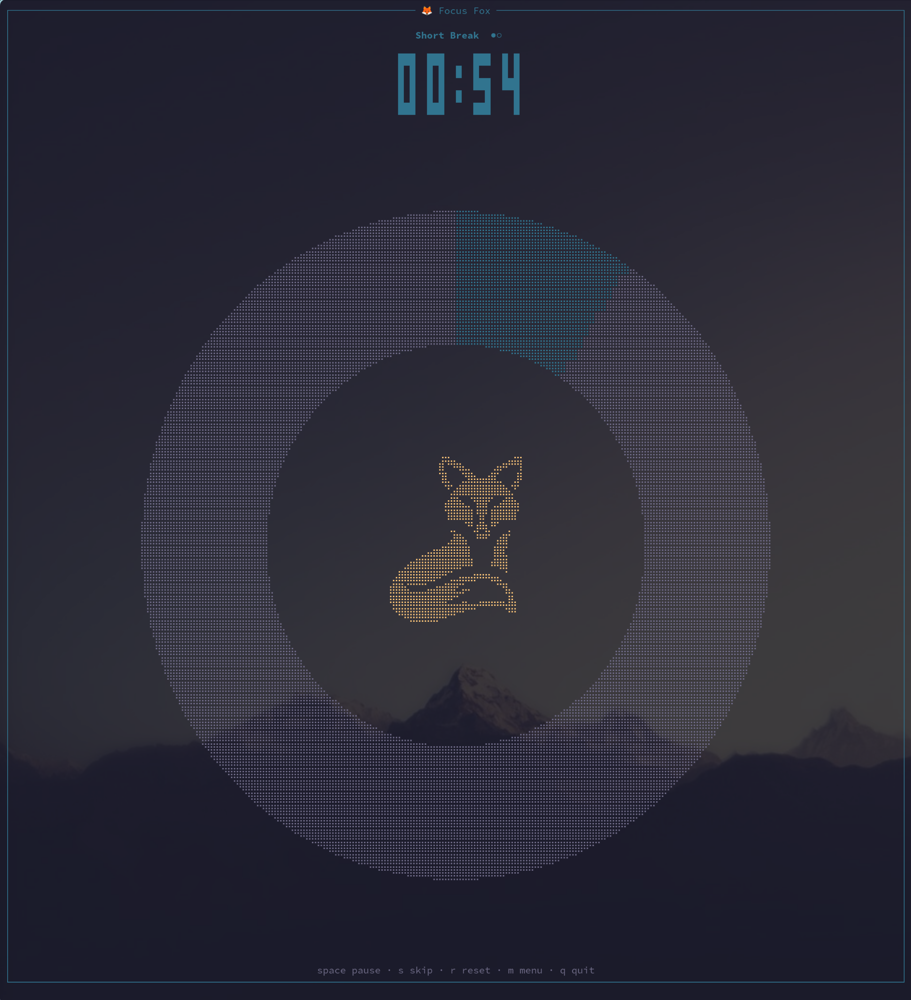

# 🦊 Focus Fox

A terminal-based pomodoro timer. Work sessions, short breaks, and a long
break every few sessions — with a big clock, a progress ring with a fox
in the middle, and desktop notifications when phases change.

## Demo

https://github.com/user-attachments/assets/59594780-4102-4dbb-92e4-9838c95530f9

## Screenshots

| Menu | Focus session |
|------|---------------|
|  |  |

| Phase transition | Break |
|------------------|-------|
|  |  |

## Install

Grab a package from the [latest release](https://github.com/jordangarrison/focus-fox/releases/latest):

| Platform | Asset |
|----------|-------|
| Debian / Ubuntu | `focus-fox_*.deb` — `sudo dpkg -i focus-fox_*.deb` |
| Fedora / RHEL | `focus-fox-*.rpm` — `sudo rpm -i focus-fox-*.rpm` |
| Arch | `focus-fox-*.pkg.tar.zst` — `sudo pacman -U focus-fox-*.pkg.tar.zst` |
| Any Linux (static) | `focus-fox-*-linux.tar.gz` — untar and drop `fox` on your `PATH` |
| macOS (Apple Silicon) | `focus-fox-*-aarch64-darwin.tar.gz` — untar and drop `fox` on your `PATH` |
| Nix | `nix profile install github:jordangarrison/focus-fox` |

Windows: use WSL with any of the Linux options.

Desktop notifications shell out to `notify-send` (Linux), so install
`libnotify` if you want them; the timer works fine without it.

## Usage

```bash
fox                             # 25m work / 5m break / 15m long break every 4
fox -w 45m -b 10m               # custom work and break lengths
fox --sessions 3                # long break after 3 work sessions
fox --no-notify                 # skip desktop notifications
```

The binary is installed as both `fox` and `focus-fox` — same program.

Launch opens a configuration menu; tweak values there (or skip straight
past it with Enter) and start the timer.

### Keys

Menu (launch screen):

| Key           | Action                        |
|---------------|-------------------------------|
| `↑`/`↓`, `k`/`j` | select setting             |
| `←`/`→`, `h`/`l` | adjust value               |
| `Enter`       | start the timer               |
| `q`/`Esc`     | quit                          |

Menu changes are saved automatically and persist between app starts.

Timer:

| Key         | Action              |
|-------------|---------------------|
| `space`/`p` | pause / resume      |
| `s`         | skip to next phase  |
| `r`         | restart this phase  |
| `m`         | back to the menu    |
| `q`/`Esc`   | quit                |

## Configuration

Settings live at `~/.config/focus-fox/config.toml`, written automatically
whenever you adjust them in the menu (CLI flags override at launch):

```toml
work = "25m"
short_break = "5m"
long_break = "15m"
sessions_before_long_break = 4
notify = true
```

## Development

```bash
nix develop     # dev shell with rust toolchain + libnotify
cargo run
cargo test
nix build       # release build with notify-send wrapped onto PATH
```

### Release assets

```bash
nix build .#release   # all downloadable assets for this system in ./result
nix build .#deb       # just the .deb (linux)
nix build .#rpm       # just the .rpm (linux)
nix build .#arch      # just the pacman package (linux)
nix build .#tarball   # just the tar.gz
```

Pushing a `v*` tag runs the release workflow: every runner (Linux
x86_64 + arm64, macOS Apple Silicon) runs `nix build .#release` and
attaches the results to the GitHub release. No Intel mac build —
nixpkgs 26.11 dropped the platform.
