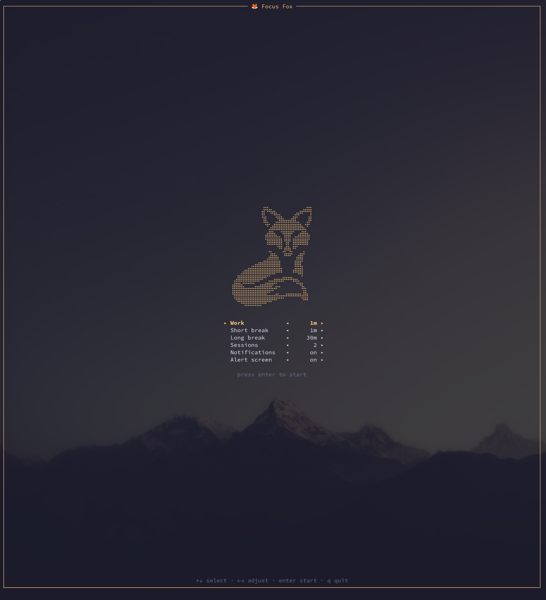
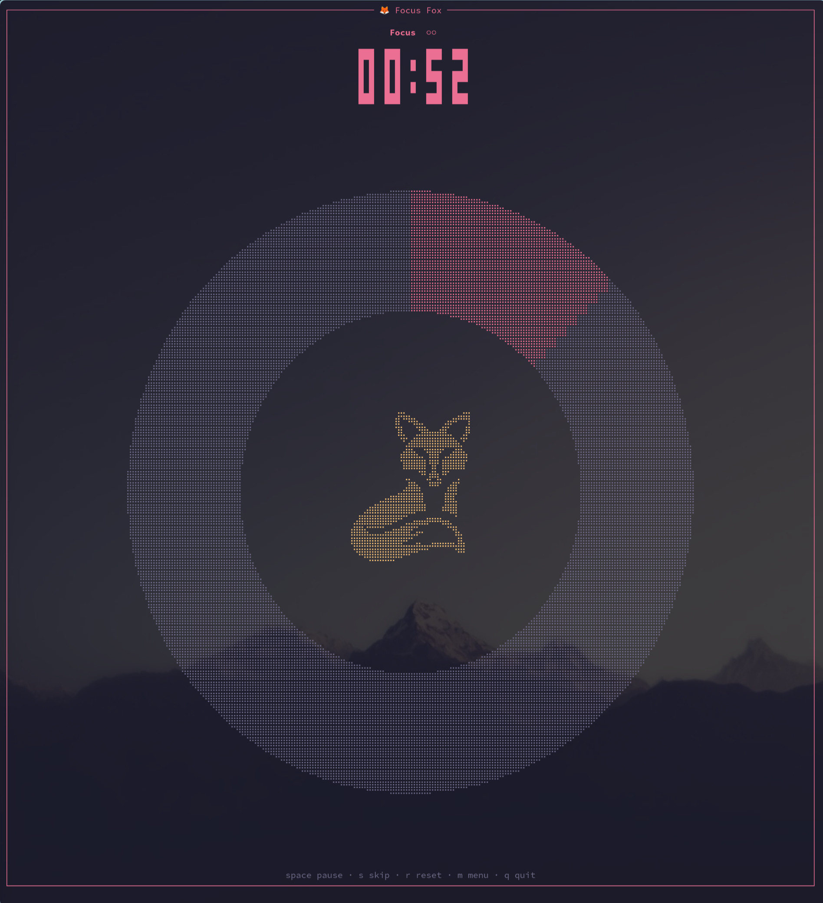
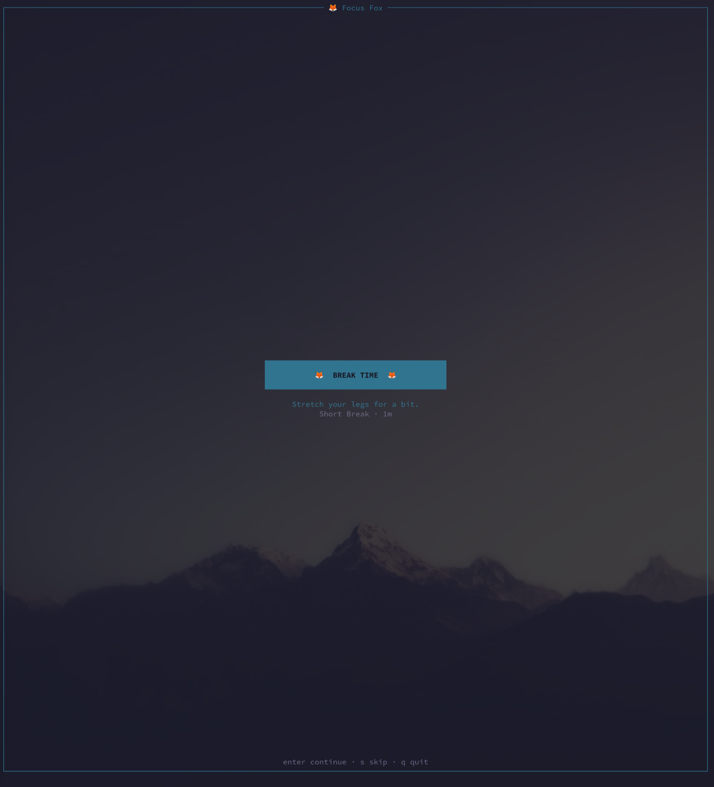
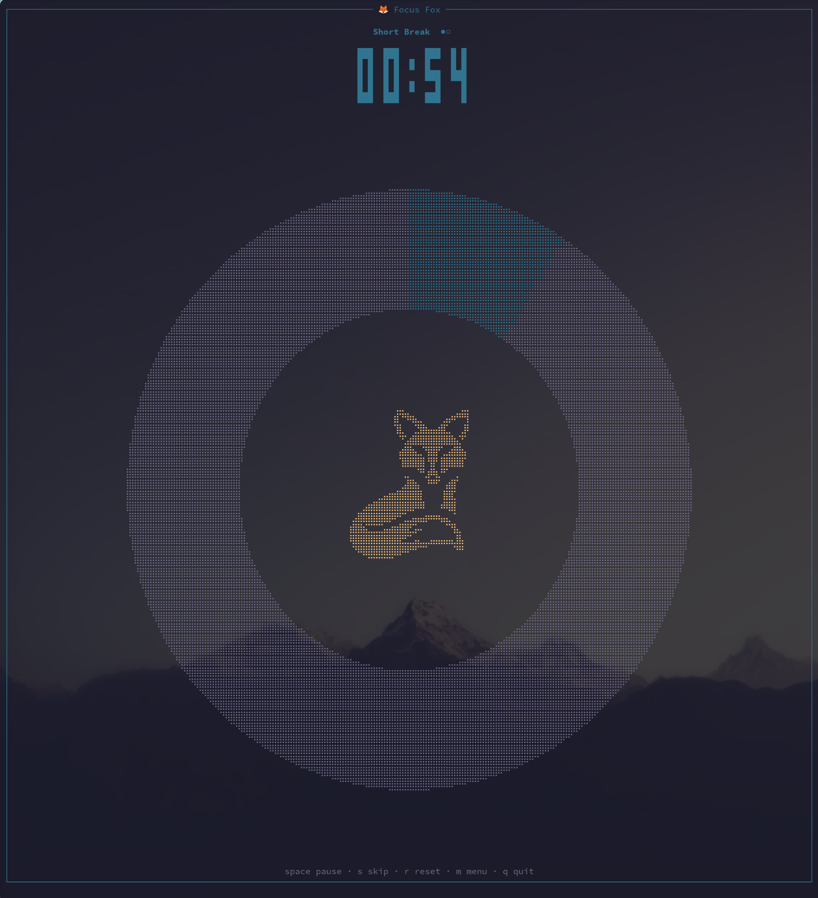

# 🦊 Focus Fox

A terminal-based pomodoro timer. Work sessions, short breaks, and a long
break every few sessions — with a big clock, a progress ring with a fox
in the middle, optional binaural beats and generative lofi music during
focus, and desktop notifications when phases change.

## Demo

https://github.com/user-attachments/assets/f23047f1-1f3f-43b7-acb8-57365687cf3a

## Screenshots

| Menu                                              | Focus session                                                  |
|---------------------------------------------------|----------------------------------------------------------------|
|  |  |

| Phase transition                                                 | Break                                       |
|------------------------------------------------------------------|---------------------------------------------|
|  |  |

## Install

Homebrew on Apple Silicon macOS, ARM64 Linux, or x86_64 Linux:

```bash
brew install jordangarrison/tap/focus-fox
```

Intel macOS is not supported.

Or grab a package from the [latest release](https://github.com/jordangarrison/focus-fox/releases/latest):

| Platform              | Asset                                                                     |
|-----------------------|---------------------------------------------------------------------------|
| Debian / Ubuntu       | `focus-fox_*.deb` — `sudo dpkg -i focus-fox_*.deb`                        |
| Fedora / RHEL         | `focus-fox-*.rpm` — `sudo rpm -i focus-fox-*.rpm`                         |
| Arch                  | `focus-fox-*.pkg.tar.zst` — `sudo pacman -U focus-fox-*.pkg.tar.zst`      |
| Any Linux (static)    | `focus-fox-*-linux.tar.gz` — untar and drop `fox` on your `PATH`          |
| macOS (Apple Silicon) | `focus-fox-*-aarch64-darwin.tar.gz` — untar and drop `fox` on your `PATH` |
| Nix                   | see [Nix](#nix) below                                                     |

Windows: use WSL with any of the Linux options.

### Nix

Try it without installing:

```bash
nix run github:jordangarrison/focus-fox
```

Install into your profile:

```bash
nix profile install github:jordangarrison/focus-fox
```

Or add it as a flake input to your NixOS / home-manager config:

```nix
{
  inputs.focus-fox.url = "github:jordangarrison/focus-fox";

  # then in your system or home-manager packages:
  # environment.systemPackages = [ inputs.focus-fox.packages.${pkgs.system}.default ];
  # home.packages = [ inputs.focus-fox.packages.${pkgs.system}.default ];
}
```

Desktop notifications shell out to `notify-send` (Linux), so install
`libnotify` if you want them; the timer works fine without it.
Audio uses ALSA on Linux and CoreAudio on macOS. Debian, RPM, and Arch packages
declare their distribution's ALSA configuration package. When installing the
standalone Linux tarball, make sure ALSA runtime data is installed (normally
provided by `libasound2-data` or `alsa-lib`).

## Launch from a hotkey or app icon

Focus Fox is a terminal app, but you don't have to open a terminal by hand.
Tell your launcher to run your terminal with `fox` as the command (`fox` is
the name every install method provides; `focus-fox` is the same binary):

| Terminal       | Command                                                   |
|----------------|-----------------------------------------------------------|
| Alacritty      | `alacritty --class focus-fox --title "Focus Fox" -e fox`  |
| kitty          | `kitty --class focus-fox --title "Focus Fox" fox`         |
| Ghostty        | `ghostty --title="Focus Fox" -e fox`                      |
| WezTerm        | `wezterm start --class focus-fox -- fox`                  |
| foot           | `foot --app-id focus-fox --title "Focus Fox" fox`         |
| GNOME Terminal | `gnome-terminal --title "Focus Fox" -- fox`               |
| Konsole        | `konsole -e fox`                                          |

The `--class focus-fox` / `--app-id focus-fox` flags give the window its
own identity instead of the terminal's, which is what lets desktops group
and pin it as Focus Fox (see the app-icon setup below).

### Linux

**Hotkey:** bind one of the commands above to a custom keyboard shortcut.

- GNOME: Settings → Keyboard → View and Customize Shortcuts → Custom
  Shortcuts → `+`
- KDE Plasma: System Settings → Keyboard → Shortcuts → Add New → Command

**App icon:** copy [`contrib/focus-fox.desktop`](contrib/focus-fox.desktop)
to `~/.local/share/applications/` and set its `Exec` line to your terminal
(the file lists the alternatives). Focus Fox then appears in your app grid
and can be pinned to the dock or panel. The entry sets
`StartupWMClass=focus-fox` to match the `--class`/`--app-id` flags above,
so the running window groups under the Focus Fox icon instead of the
terminal's. Terminals without a class flag (GNOME Terminal, Konsole) still
launch fine from the entry, but their windows group under the terminal's
own icon. The example also names a terminal directly on purpose: the
generic `Terminal=true` key is handled inconsistently across GNOME, KDE,
and XFCE.

### macOS

**Raycast:** [`contrib/raycast/focus-fox.sh`](contrib/raycast/focus-fox.sh)
is a ready-made script command that opens Focus Fox (`fox`) in a new
Terminal window (with an iTerm2 variant in a comment). Add its folder in
Raycast → Settings → Extensions → Script Commands → Add Directories, then
launch it from Raycast or give it a hotkey there.

## Usage

```bash
fox                             # 25m work / 5m break / 15m long break every 4
fox -w 45m -b 10m               # custom work and break lengths
fox --sessions 3                # long break after 3 work sessions
fox --no-notify                 # skip desktop notifications
fox --theme light               # force light colors (auto, dark, or light)
fox stats                       # session history summary (today/week/streak)
```

The binary is installed as both `fox` and `focus-fox` — same program.

Launch opens a configuration menu; tweak values there (or skip straight
past it with Enter) and start the timer. Binaural tone presets, Custom tone
controls, volume, lofi music, and preview live in the Audio settings
overlay, reachable from both the launch menu and the running timer.

### Keys

Menu (launch screen):

| Key              | Action                              |
|------------------|-------------------------------------|
| `↑`/`↓`, `k`/`j` | select setting                      |
| `←`/`→`, `h`/`l` | adjust value                        |
| `Enter`          | start timer, or open Audio settings |
| `a`              | open Audio settings                 |
| `q`/`Esc`        | quit                                |
|                  |                                     |

Menu changes are saved automatically and persist between app starts.

Audio settings (overlay over the menu or the timer):

| Key               | Action              |
|-------------------|---------------------|
| `↑`/`↓`, `k`/`j`  | select setting      |
| `←`/`→`, `h`/`l`  | adjust value        |
| `p`               | toggle live preview |
| `Enter`/`Esc`/`A` | close the overlay   |

Preview plays both the tones and the music even when playback is disabled,
so you can balance the two volumes. It stops when you
close the overlay or quit. Opened from the timer, the clock keeps ticking
underneath and work audio keeps playing, so you can adjust the tone live.

Timer:

| Key              | Action                           |
|------------------|----------------------------------|
| `space`/`p`      | pause / resume                   |
| `s`              | skip to next phase               |
| `r`              | restart this phase               |
| `←`/`→`, `h`/`l` | jump back / forward 1m           |
| `a`              | toggle binaural audio            |
| `b`              | toggle lofi music                |
| `A`              | Audio settings overlay           |
| `t`              | stats overlay (`t`/`Esc` closes) |
| `m`              | back to the menu                 |
| `q`/`Esc`        | quit                             |

Jumping forward past the end finishes the phase as if it ran out
naturally; jumping back stops at the start of the phase. Toggling audio
with `a` or music with `b` persists to the config file, just like
changing it in the menu.

## Configuration

Settings live at `~/.config/focus-fox/config.toml`, written automatically
whenever you adjust them in the menu (CLI flags override at launch):

```toml
work = "25m"
short_break = "5m"
long_break = "15m"
sessions_before_long_break = 4
notify = true
alert_screen = true
binaural_beats = false
binaural_preset = "gamma_experiment"
binaural_base_hz = 220
binaural_beat_hz = 40
binaural_volume_percent = 36
music_enabled = false
music_source = "lofi"
music_volume_percent = 36
music_during_breaks = false
theme = "auto"
```

Set `binaural_beats = true` in the menu or config file (or press `a` on the
timer screen) to play stereo tones during unpaused Work phases. Playback stops during breaks, pauses, phase
alerts, menu visits, and exit. Default selection is disabled with the Gamma
experiment preset.

Built-in listening modes:

| Preset             | Left / right tones | Difference |
|--------------------|--------------------|------------|
| Active focus       | 220 / 238 Hz       | 18 Hz      |
| Gamma experiment   | 220 / 260 Hz       | 40 Hz      |
| Research gamma     | 320 / 360 Hz       | 40 Hz      |
| Calm concentration | 220 / 230 Hz       | 10 Hz      |
| Meditative         | 220 / 226 Hz       | 6 Hz       |
| Wind-down          | 160 / 163 Hz       | 3 Hz       |
| Custom             | 100–1000 Hz base   | 1–100 Hz   |

Preset names are listening modes, not promises of cognitive or health effects.
Custom base tone changes in 10 Hz steps; beat difference changes in 1 Hz steps.
One Custom slot persists while you try built-in presets. Editing a built-in base
or difference copies that preset into Custom before changing it.

Beat and music volumes are 1–100% and both default to 36%. The two channels
are loudness-calibrated to a shared reference, so the same percentage
produces the same output level on either slider (100% ≈ −16 dBFS RMS).

Upgrading from 0.6 or earlier: volumes now live on this calibrated scale, so
a stored `binaural_volume_percent` keeps its number but plays quieter than it
used to — raise an old `8` to about `36` for the previous loudness.

### Lofi music

Set `music_enabled = true` in the Audio settings overlay (or press `b` on
the timer screen) to layer endless generative lofi music under the beats —
mellow e-piano chords, soft bass, gentle percussion, and vinyl crackle,
synthesized on the fly with no audio files or network. Music has its own
volume (loudness-matched to the beats — equal percentages sound equally
loud), plays with or without the beats, and follows the same rules: unpaused
Work phases only, unless `music_during_breaks = true` keeps it going through
breaks (the beats stay work-only).

The music matches whatever the beats are doing. The preset sets the mood —
focus and gamma presets get brighter, more rhythmic backing; Calm
concentration and Meditative get sparser, softer; Wind-down turns ambient and
drumless. The key follows the base tone and the tempo is derived from the
beat difference, so nothing clashes with the tones. Every session is a fresh
performance that never audibly loops.

Headphones are required for the binaural effect. Start at a safe volume and
stop listening if sound becomes uncomfortable. Audio-device failures are
non-fatal and appear in the status line. Older configs migrate automatically:
legacy 40 Hz uses Gamma experiment, while other differences become Custom with
a 220 Hz base.

`theme = "auto"` queries the terminal background when Focus Fox starts and
selects the matching palette. This follows the terminal rather than the OS
theme because terminal color schemes can be configured independently. Use
`"dark"` or `"light"` to override detection. The setting is also available in
the launch menu and through `--theme`. Terminals without verified true-color
support automatically use an ANSI palette.

## Development

```bash
nix develop     # dev shell with rust toolchain + libnotify + ALSA on Linux
cargo run
cargo test
nix build       # release build with notify-send wrapped onto PATH
```

### Release assets

```bash
nix build .#release   # all downloadable assets for this system in ./result
nix build .#deb       # just the .deb (linux)
nix build .#rpm       # just the .rpm (linux)
nix build .#arch      # just the pacman package (linux)
nix build .#tarball   # just the tar.gz
```

Releases are automated with release-please: `feat:`/`fix:` commits on
`main` accumulate into a release PR, and merging it bumps the version,
updates the changelog, tags, and creates the GitHub release. The release
workflow then builds every asset with `nix build .#release` on Linux
(x86_64 + arm64) and macOS (Apple Silicon) runners and attaches them.
After every asset uploads, it dispatches the shared
[`jordangarrison/homebrew-tap`](https://github.com/jordangarrison/homebrew-tap)
updater and waits for its macOS/Linux test matrix. A successful tap run commits
the new checksums directly to the tap's `main` branch; a failure leaves the
GitHub release published and the formula unchanged so the dispatch can be
retried safely. No Intel mac build — nixpkgs 26.11 dropped the platform.
Pushing a `v*` tag by hand triggers the same asset build and tap update.
